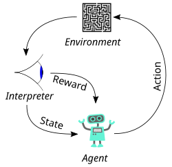

# Documentación Trabajo RL

**Kevin Silvares Carbonell y Mario Merayo Barredo**

# Índice

- [1.- Introducción](#1--introducción)
  - [1.1.- Objetivo del proyecto](#11--objetivo-del-proyecto)
  - [1.2.- Tecnologías usadas](#12--tecnologías-usadas)
- [2.- Conceptos Técnicos](#2--conceptos-técnicos)
  - [2.1.- Conceptos de Reinforcement Learning (Aprendizaje por Refuerzo)](#21--conceptos-de-reinforcement-learning-aprendizaje-por-refuerzo)
  - [2.2.- Entorno](#22--entorno)
    - [2.2.1.- Circuitos](#221--circuitos)
    - [2.2.2.- Espacio de Observación](#222--espacio-de-observación)
    - [2.2.3.- Espacio de Acciones](#223--espacio-de-acciones)
  - [2.3.- Algoritmos](#23--algoritmos)
    - [2.3.1.- A2C](#231--a2c)
    - [2.3.2.- SAC](#232--sac)
  - [2.4.- Métricas Más Importantes](#24--métricas-más-importantes)
    - [2.4.1.- Reward (Recompensa)](#241--reward-recompensa)
    - [2.4.2.- Coeficiente de Entropía](#242--coeficiente-de-entropía)
    - [2.4.3.- Pérdida del Valor (Value Loss)](#243--pérdida-del-valor-value-loss)
- [3.- Desarrollo del Proyecto](#3--desarrollo-del-proyecto)
  - [3.1.- Usando Imágenes y CNN](#31--usando-imágenes-y-cnn)
    - [3.1.1.- El óvalo](#311--el-óvalo)
    - [3.1.2.- Circuitos procedimentales](#312--circuitos-procedimentales)
  - [3.2.- Usando Vectores y MLP](#32--usando-vectores-y-mlp)
    - [3.2.1.- Primer entrenamiento](#321--primer-entrenamiento)
  - [3.3.- Pedagogía de la IA](#33--pedagogía-de-la-ia)
    - [3.3.1.- Reward Shaping (Distribución de Recompensa)](#331--reward-shaping-distribución-de-recompensa)
    - [3.3.2.- Curriculum Learning](#332--curriculum-learning)
    - [3.3.3.- Preservación del Mejor Algoritmo](#333--preservación-del-mejor-algoritmo)
- [4.- Conclusiones y futuro](#4--conclusiones-y-futuro)

# 1.- Introducción

En este documento se detalla el desarrollo de un agente entrenado mediante *Reinforcement Learning* (Aprendizaje por Refuerzo, en adelante RL) que simula ser un coche aprendiendo a navegar por distintos circuitos.

## 1.1.- Objetivo del proyecto

El objetivo principal del proyecto ha sido crear un entorno de simulación donde el vehículo aprenda a conducir por sí mismo, a base de ensayo y error, por diferentes circuitos, tanto estáticos y simples como procedimentales y aleatorios. 

Los objetivos específicos son:

- **Desarrollo de un entorno personalizado:** Crear una simulación compatible con el estándar Gymnasium que presente retos de dificultad progresiva (técnica conocida como Curriculum Learning).
- **Optimización del Agente:** Implementar, entrenar y ajustar algoritmos como SAC (Soft Actor-Critic) y A2C para lograr una conducción fluida y eficiente en circuitos no vistos anteriormente (demostrando una correcta generalización del modelo).
- **Interfaz visual e interactiva**: Desarrollar una interfaz gráfica que permita a cualquier usuario manejar el proyecto, lanzar entrenamientos y visualizar los resultados de forma intuitiva, sin necesidad de interactuar directamente con la consola de comandos ni modificar código fuente en Python. (Aunque figure como objetivo del proyecto no se comentará nada de este apartado en esta documentación, pues su contenido sería escaso y poco relevante con lo aquí descrito. Es por ello que lo referente al uso de esta interfaz se encuentra en Anexo: Uso de Interfaz).

## 1.2.- Tecnologías usadas

Para el desarrollo del proyecto se ha seleccionado un stack tecnológico de nivel industrial, pero adaptado para su ejecución en entornos de computación locales (ordenadores personales). A diferencia de la propuesta inicial que contemplaba el uso de infraestructura del centro o la nube, hemos optado por optimizar el desarrollo para hardware propio, lo que ha condicionado y motivado gran parte de nuestras decisiones de optimización.

- **Lenguaje de Programación:** Python.
- **Hardware de Desarrollo:** El entrenamiento y las pruebas se han realizado íntegramente en ordenadores personales. Lidiar con esta capacidad de cómputo limitada (y con el ordenador completamente bloqueado durante horas durante los entrenamientos) justificó pivotar hacia el espacio de observación vectorial del que se habla en el apartado [3.2 Usando Vectores](#32--usando-vectores-y-mlp).
- **Frameworks de IA:**
    - **PyTorch:** Para la construcción de las arquitecturas de redes neuronales (CNN y MLP) y manejo de sus cálculos.
    - **Stable-Baselines3:** Para la implementación de los algoritmos de RL y wrappers de procesamiento (como el Frame Stacking).
- **Simulación:** **Gymnasium** (evolución de OpenAI Gym) ****para la estructuración lógica y definición de reglas del entorno, y **Pygame** para la creación y renderizado de los circuitos y las físicas del coche.
- **Visualización y Despliegue:**
    - **Streamlit:** Para la creación de la interfaz gráfica e interactiva y de un pequeño dashboard.
    - **Entorno Virtual de Python**: Para el empaquetado de las dependencias y la reproducibilidad en otros equipos. Utilizamos un entorno virtual y no Docker porque este maneja muy mal la creación de interfaces visuales como las de Pygame. Es una cuestión de simpleza.
- **Análisis y Monitorización:**
    - **TensorBoard:** Visualización del rendimiento de los modelos durante y después del entrenamiento.
    - **Altair**: Aunque va implícito en Streamlit, esta librería es la utilizada para representar gráficas en la interfaz gráfica.

# 2.- Conceptos Técnicos

En este punto se contemplan los conceptos técnicos más relevantes del Reinforcement Learning (a partir de ahora RL) para poder comprender este documento.

## 2.1.- Conceptos de Reinforcement Learning (Aprendizaje por Refuerzo)

El RL es una técnica de Machine Learning (Aprendizaje Automático) cuyo objetivo es que un agente pueda aprender a desarrollar tareas de forma autónoma al ser entrenado en un entorno o simulación similares a los de su área de trabajo posterior.

La idea detrás de esto es que el agente observe el estado de su entorno, pruebe a realizar acciones y reciba una retroalimentación sea en forma de recompensa (si son la acción correcta) o penalización (si son la acción errónea), lo que se traduce en una puntuación numérica. El objetivo del agente siempre será maximizar esta recompensa, aunque esto puede llevar a resultados no esperados si el entorno o la recompensa no están bien ajustados:

- El agente queda “asustado” (Óptimo Local): En este caso el agente prefiere no realizar acciones y no perder puntos a arriesgarse a tener una penalización muy severa.
- El agente encuentra un vacío legal (Reward Hacking). Si el entorno y las recompensas no están bien hechos, el agente puede encontrar formas de maximizar su recompensa sin cumplir con los objetivos esperados (ej: se queda parado, avanza y retrocede, da vueltas, etc.).



*Figura 1. Esquema básico del Aprendizaje por Refuerzo.*

Estos conceptos serán tratados en profundidad más adelante.

## 2.2.- Entorno

El entorno es el mundo dónde se mueve el agente, con sus físicas, normas y recompensas tras realizar acciones. En el caso del proyecto, este entorno está compuesto por los circuitos de carreras.

Es importante destacar que las físicas del entorno de este proyecto son muy simples y no buscan ser un reflejo fiel de la realidad. Por ejemplo, en el entorno existe una fricción que no se calcula dinámicamente usando el peso del coche o el agarre de sus neumáticos; en el entorno es un valor fijo que decelera progresivamente cuando el coche no está acelerando.

Tampoco existe una ley de la gravedad y, por lo tanto, no hay transferencia de pesos del coche, por lo que no es del todo esperable que el agente trace las curvas, de exterior → vértice → exterior, como se trazarían en la vida real. - *Realmente este tipo de trazadas también responden a un problema geométrico, pero el punto es que las físicas son ultra simplificadas en comparación con las reales*-.

Además, los entornos pueden ser:

- **Deterministas**: Si realizar una acción da el mismo resultado siempre. Ej: Acelerar un 20% aumenta la velocidad un 20% siempre, independientemente de todo. Es el caso de este proyecto.
- **Estocásticos**: Si realizar una acción no garantiza siempre el mismo resultado. Ej: Accionar “Subir” puede acabar con el agente en la celda de la izquierda. No es el caso de este proyecto, pero es un fenómeno interesante que se explica perfectamente en el entorno [Frozen Lake de Gymnasium](https://gymnasium.farama.org/environments/toy_text/frozen_lake/). Como nota, este tipo de entornos enseñan a los agentes a reaccionar ante adversidades de la vida real como una ráfaga de viento repentina para un dron.

Aunque existen diferentes clase de “Entornos” en el código fuente del proyecto, sólo el de la clase `entorno_def.py` es el definitivo y usado en este proyecto. El resto pueden ser considerarse tests previos para llegar a este.

### 2.2.1.- Circuitos

Simulando un coche de carreras, el agente se mueve por circuitos como si de un piloto se tratase. Para el entrenamiento se han diseñado dos tipos de circuitos:

- **Óvalo**: Un óvalo perfecto y estático, creado principalmente como entorno de pruebas inicial para que el agente dé sus primeros pasos, entienda las físicas y acciones que puede realizar y las recompensas asociadas a estas antes de enfrentarse a un reto real. A esta técnica se le llama [Aprendizaje Curricular (Curriculum Learning)](#332--curriculum-learning) y será tratada más adelante.
- **Circuitos procedimentales**: Estas pistas se generan aleatoriamente mediante un algoritmo, por lo que nunca existirán dos circuitos idénticos. Tienen diferentes tipos de curvas y suponen un reto a la generalización del modelo. Si el agente es capaz de navegar por estos circuitos quiere decir que su generalización es buena y que no sólo ha aprendido a correr en el óvalo (sobreajuste, *overfitting*), sino que ha aprendido a conducir de verdad.

Estas pistas son generadas en la clase `track_gen.py`.

Los circuitos cuentan con una serie de puntos de control (Checkpoints) que el algoritmo va a buscar para poder calcular su próximo objetivo.

Ambos tipos de circuitos se han diseñado bajo la misma idea de *generación mediante coordenadas polares*, que se resume en:

1. **Distribución base:** Se genera un número de puntos y se distribuyen de forma equitativa en un espacio circular. En el caso de los circuitos procedimentales, se aplica un ruido al radio de cada punto para evitar crear círculos perfectos y añadir aleatoriedad en las curvas.
2. **Suavizado:** Se suaviza la trayectoria creada entre estos puntos. De no hacerlo, la superficie sería un polígono irregular con unas curvas acabadas en picos. Para esto se aplica una *spline* o curva matemática para crear puntos entre los puntos ya existentes, generando así 100 puntos por pista que servirán de Checkpoints para el agente durante el entrenamiento.
3. **Extrusión:**
    1. Se calcula la tangente del punto para deducir hacia donde avanza el circuito. 
    2. Se normaliza (longitud = 1) para tener valores estándar y evitar errores por las diferentes distancias. 
    3. Se calcula la normal (se gira el vector obtenido 90º) y se obtiene un vector perpendicular que apunta directamente a ambos lados de la pista. 
    4. Se aplica la mitad de un ancho obtenido por parámetro como distancia de este punto al nuevo punto, que será el punto interior/exterior del circuito y se dibuja la línea. Este proceso se realiza por cada punto del circuito.

***Nota:** El proceso del óvalo es similar, pero en lugar de 100 Checkpoints se generan 50 y no se aplica ningún ruido.*

Como apunte: Existió un problema prolongado en el que los circuitos procedimentales no se generaban correctamente. Es por ello que existe una salvaguarda en forma de función `generate_valid_track()` que comprueba que el circuito sea válido mediante el cálculo de los ángulos entre sus checkpoints (si es demasiado grande, el circuito no será transitable). De no serlo devuelve un óvalo para esta iteración. En este punto del proyecto, casi el 100% de los circuitos generados procedimentalmente son válidos.

### 2.2.2.- Espacio de Observación

El Espacio de Observación se refiere a todo aquello que el agente percibe del entorno para poder realizar sus acciones. Haciendo la analogía, puede definirse como los sentidos del modelo.

Aunque en los puntos [3.1.- Usando Imágenes y CNN](#31--usando-imágenes-y-cnn) y [3.2.- Usando Vectores y MLP](#32--usando-vectores-y-mlp) se hablará más en detalle de los espacios de observación utilizados podemos resumirlos en este punto:

- **Imágenes**: El algoritmo “ve” el entorno a través de capturas procesadas por una Red Neuronal Convolucional (CNN). Se realiza una captura, se transforma en algo más ligero y fácil de procesar para la red (se aplica una escala de grises y se reescala) y el agente toma una decisión analizando esos píxeles. Este tipo de espacio de observación es mucho más pesado computacionalmente que los vectores convencionales debido a la cantidad de píxeles que componen una imagen, especialmente cuando el modelo debe procesar decenas por segundo.
- **Vectores**: El algoritmo lee directamente variables numéricas puras que reflejan su propio estado y el del entorno. En el caso del proyecto se ha construido una observación ligero y simple compuesto por: posición, orientación y velocidad del coche, y las coordenadas de su próximo checkpoint.

### 2.2.3- Espacio de Acciones

El Espacio de Acciones compone las diferentes acciones y controles que puede realizar el agente sobre el entorno. Siguiendo con las analogías, puede definirse como “el mando” del modelo si el entorno fuese su juego.

Existen dos espacios de acciones:

- **Discretos:** El agente debe elegir una acción concreta dentro de un conjunto finito de opciones mutuamente excluyentes. Esto quiere decir, que nunca pueden realizarse simultáneamente y siempre se realizan de forma secuencial. Estas acciones suelen estar representadas por números enteros que suelen actuar como valores booleanos o digitales (0/1, apagado/encendido). Ej: Un agente que navega por un laberinto y en cada paso sólo puede elegir entre moverse arriba, abajo, a la izquierda o la derecha.
- **Continuos:** El agente puede realizar acciones simultáneas y con diferentes grados de intensidad. Estas acciones suelen estar representadas como números decimales. Ej: El coche puede acelerar al 80% y girar un 20% al mismo tiempo.

En el caso del proyecto, el espacio de acción es continuo. El agente tiene a su disposición un vector de acción de dos dimensiones (dos valores numéricos) que van desde `-1.0` hasta `1.0`:

- **Girar (Componente 1)**: Define la dirección del volante. Un valor negativo indica un giro a la izquierda, mientras que un valor positivo indica un giro a la derecha. La intensidad del giro es proporcional al valor absoluto del número. Ej: `-0.30` → girar a la izquierda un 30%.
- **Acelerar/Frenar (Componente 2)**: Controla los pedales del coche. Si el valor es mayor a `0.0`, el agente acelera y añade velocidad. Si el valor es negativo, el agente frena y decelera. Similar al giro, la intensidad de aceleración y frenado es proporcional al valor absoluto del número.
    
    **Nota:** Inicialmente el agente podía dar marcha atrás al dar un valor negativo (lo que puede considerar “Acelerar” de forma negativa). Sin embargo, lo usaba para maximizar su recompensa al ser penalizado por no moverse (se hablará de ello más en profundidad en el punto [3.3.1.- Reward Shaping](#331--reward-shaping-distribución-de-recompensa)).
    

## 2.3.- Algoritmos

En este punto se detallan las características de los algoritmos utilizados en este proyecto. Como se ha mencionado, ambos algoritmos están pensados para operar en espacios de acción continuos (girar y acelerar/frenar de forma gradual), lo que resulta en una simulación de conducción mucho más natural, precisa y fluida en comparación con los movimientos rígidos que produciría un espacio de acción discreto.

*Nota: Los algoritmos pre-entrenados proporcionados en las carpetas del proyecto han sido entrenados con un total de 1 millón de pasos cada uno. Esto ha sido, principalmente, para favorecer la comparación directa visual.*

### 2.3.1.- A2C

El algoritmo A2C es la versión síncrona del paradigma Actor-Crítico, una arquitectura que divide la inteligencia del modelo en dos redes neuronales que trabajan en simbiosis para optimizar el aprendizaje:  

- **El Actor (La Política):** Es la parte de la red encargada de realizar las acciones. Mapea el estado actual (los vectores de posición, velocidad y checkpoints) hacia una acción específica. Al trabajar en un espacio continuo, el actor define una distribución de probabilidad (normalmente una Gaussiana) de la que se extraen los valores de giro y aceleración.
- **El Crítico (La Función de Valor):** Su función es evaluar lo bueno o malo del estado actual en el que el Actor ha metido al coche. Intenta predecir cuánta recompensa total a futuro puede esperar el agente estando en esa posición concreta, independientemente de la acción que se esté realizando en ese mismo instante.
- **La Ventaja (Advantage):** A2C mejora el aprendizaje mediante el cálculo de la ventaja:
    
    $$
    A = Q(s, a) - V (s)
    $$
    
    En esencia, esta fórmula le indica al Actor si la acción realizada resultó en una recompensa mayor que la que el Crítico había predicho:
    
    - Es mayor: El Actor refuerza esa decisión y será más propenso a repetirla.
    - Es menor: El Actor ajusta su probabilidad para no volver a tomar dicha decisión.
    
    La fórmula puede leerse como:
    
    - **A (Advantage/Ventaja)**: Resultado final. Indica matemáticamente cuánto mejor o peor ha sido la decisión en comparación.
    - **Q(s, a) (Función Acción-Valor)**: El valor de $Q$ de tomar la acción $a$ en el estado s. Es decir, el resultado obtenido por el Actor al realizar una acción en su estado actual.
    - **V(s) (Función de Valor del Estado)**: El valor $V$ del estado $s$. Es la estimación del Crítico, lo que esperaba ganar por estar en esa posición concreta, independientemente de la acción a realizar.

A2C es un algoritmo altamente optimizado en cuanto a coste computacional se refiere. Es un algoritmo más clásico que SAC y se nota en sus resultados; su forma de conducir da rebotes más a menudo y no siempre completa las pistas a pesar de tener el mismo número de pasos de entrenamiento que SAC. En contraparte, es sumamente rápido en entrenamiento si comparamos ambos.

La conclusión que podemos obtener de este algoritmo es que es un perfecto banco de pruebas, ideal para realizar ajustes rápidos y comprobar distribuciones de recompensa, cambios en las físicas o normas del entorno, etc.

### 2.3.2.- SAC

SAC es uno de los algoritmos más avanzados para RL en entornos continuos y ha sido el motor principal de nuestras pruebas más exitosas. Su arquitectura es la principal clave del éxito de sus resultados. Esta característica clave es la **Optimización de la Entropía Máxima**:

**Optimización de la Entropía Máxima**

Los algoritmos tradicionales buscan maximizar ciegamente la recompensa acumulada, mientras que SAC busca maximizar la recompensa y la entropía.

Aunque se detalla en el punto 2.4.2.- Coeficiente de Entropía, podemos definir esta medida como la relación entre aleatoriedad y confianza en el propio conocimiento del agente. Al premiar al modelo por mantener una alta entropía, el algoritmo incentiva al coche a explorar de forma activa.

Esta característica es indispensable para reducir el riesgo de quedar en óptimos locales. Como se detalla en el punto 3.3.1.- Reward Shaping, el agente tendía a adoptar estrategias mediocres pero seguras (quedarse quieto). La optimización de la entropía de SAC lo obliga a intentar cosas nuevas para que no se estanque en esos comportamientos. En esencia, es como si de tanto en tanto el algoritmo tuviese un subidón de curiosidad y empiece a explorar.

Además, SAC cuenta con otras características sumamente importantes.

**Arquitectura Off-Policy y Replay Buffer**

Los algoritmos tradiciones de RL aprenden de su experiencia inmediata. Por ejemplo, A2C realiza una acción, entiende como le afecta, guarda el peso y luego olvida cómo le ha afectado. SAC, por su parte, tiene un Replay Buffer (Buffer de Repetición) que actúa como una memoria a corto plazo.

- El coche conduce y va guardando en esta memoria lotes de datos entre los que se encuentran su estado, su acción, la recompensa y cual fue el estado resultante.
- Durante el entrenamiento, SAC toma muestras aleatorias de la memoria y aprende de ellas. Esto es lo que es RL se conoce como Sample Efficiency (Eficiencia de Muestras). El algoritmo aprende mucho más con muchos menos intentos, lo que resulta vital para mantener los entrenamientos en tiempos razonables (si tenemos en cuenta que se realizaban en ordenadores personales que debían de hacer otras tareas también). Es esta característica la que le ha dotado a SAC de una fiabilidad inmensa frente a A2C en la compleción de circuitos.

**Ajuste Automático de la Entropía**

Como se ha explicado, la entropía es la relación entre exploración y confianza. Al contrario que A2C, que debe fijar su entropía como un hiperparámetro antes del entrenamiento, SAC la ajusta durante el entrenamiento mediante un parámetro $\alpha$, conocido como “Temperatura”.

- Si consigue maximizar su recompensa teniendo en cuenta su conocimiento, ajusta la temperatura a un valor bajo (Fase de Explotación)
- Si no consigue buenos resultados, la eleva automáticamente para explorar más y descubrir nuevos estados (Fase de Exploración).

La conclusión obtenida de SAC es que es un algoritmo brillante en cuanto a resultados. Su arquitectura, mucho más moderna que A2C, se hace notable en la calidad de conducción que genera. 

Como se ha mencionado, ha demostrado una fiabilidad mucho mayor que A2C con el mismo número de pasos de entrenamiento. Esto se debe a la eficiencia de muestras otorgada por el Replay Buffer. El resultado es tan contundente que, a fecha de la redacción de este documento, no se le ha visto fallar durante las visualizaciones en pistas procedimentales. Quizá esto indique que debemos darle un reto mayor.

El precio a pagar ha sido un coste computacional y de peso del fichero generado mayor que A2C. Es cierto que los entrenamientos no han sido tan largos (en lo relativo al tiempo) y que estas diferencias no se hacen demasiado grandes: -estamos hablando de que A2C ha sido algo más rápido de una hora de entrenarse que SAC en el mismo número de pasos-. Pero este dato debe tenerse en cuenta en entrenamientos más largos y pesados, dónde el tiempo crecerá exponencialmente.

Aún con todo, SAC ha dado los mejores resultados en cuanto a suavidad, calidad de conducción y fiabilidad y ha demostrado los mejores resultados obtenidos en este proyecto. 

## 2.4.- Métricas Más Importantes

Para evaluar el progreso de entrenamientos y el rendimiento de los algoritmos se han monitorizado algunas variables clave a través de TensorBoard.

*Nota: La fase de entrenamiento se realizó antes de la implementación de la interfaz gráfica con Streamlit. Es por ello que, aunque esta permita entrenar modelos y muestre gráficas de rendimiento, no se han utilizado para monitorizar los modelos pre-entrenados de ejemplo que se encuentran en este proyecto.*

### 2.4.1.- Reward (Recompensa)

Es el indicador principal de rendimiento. Representa la suma total de recompensas obtenidas por el agente en un episodio completo.

Existen diferentes fases en la curva de recompensa que dibuja un algoritmo de RL que indican que todo avanza correctamente:

- **Fase Inicial (Exploración)**: Al principio del entrenamiento la gráfica suele mostrar oscilaciones y los valores suelen ser negativos. Esto es completamente normal porque refleja la Fase de Exploración del agente, en la que está realizando acciones al azar sin entender qué hacen o sus consecuencias.
- **Fase de Ascenso**: A medida que el agente consigue relacionar las acciones con premios, la curva comienza a subir. En el caso del proyecto, la relación de acciones básica es:
    
    Avanzar → bueno | Salirse → malo.
    
- **Fase de Estabilización (Explotación)**: La curva de recompensas se aplana en los valores positivos altos. Este es el indicador definitivo de éxito. En el caso del proyecto, esto ocurre cuando el agente ha pasado de sobrevivir en los circuitos a intentar maximizar su recompensa al optimizar sus trazadas, velocidades, etc.

Esta gráfica en TensorBoard se suele representar como `rollout/ep_rew_mean`.


*Figura 2. Gráfica de recompensa saludable de un algoritmo SAC.* 

En la anterior imagen se muestra la curva de recompensa un algoritmo sano. En este caso no ha habido valores negativos en la Fase Inicial, pero esto no tiene por qué ser siempre así.

Además, esta métrica puede indicarnos también si el entorno está mal diseñado. Esto es algo de lo que se habla más en profundidad en el apartado 3.3.1.- Reward Shaping, pero la idea general es que un modelo puede encontrar un vacío legal para maximizar la recompensa sin llegar a completar ningún objetivo real. También puede indicarnos un “modelo asustado”, que se negaba a perder su recompensa acumulada.


*Figura 3. Gráfica de recompensa no saludable de un algoritmo SAC.*

En la gráfica de arriba se observa un modelo que mantiene su recompensa negativa, pero tampoco trata de mejorarla en ningún momento. Prefiere quedarse en su `-100.0` puntos que intentar luchar por algo más y perder otros 100 en el camino.

### 2.4.2.- Coeficiente de Entropía

En Inteligencia Artificial en general, la entropía es una medida matemática de la aleatoriedad o incertidumbre en las acciones de un agente. De forma más coloquial, es la métrica que indica qué tan segura o confiada está la red neuronal respecto a las decisiones que está tomando.

Esta métrica va desde `0.0` a `1.0`. Si la entropía supera alguno de estos umbrales es un claro indicativo de que las cosas no están yendo bien.

En el caso de algoritmos que ajusten automáticamente la entropía durante el entrenamiento, como SAC, presenta diferentes fases:

- **Entropía Alta (Fase de Exploración)**: Al inicio de cualquier ejecución, la entropía comienza en valores muy altos. Esto es normal, pues el agente no conoce nada del mundo ni de sus recompensas y necesita aprenderlo cuanto antes. Por lo tanto, comienza a probar acciones aleatorias. Es comparable con un bebé en sus fases tempranas de edad, dónde hace cosas sin saber muy bien el qué.
- **Entropía Baja (Fase de Explotación)**: A medida que el entrenamiento avanza y el agente comprende la complejidad del mundo y las consecuencias de sus acciones, la entropía cae progresivamente. Esto indica que el agente ha identificado estrategias y empieza a ejecutarlas con seguridad, reduciendo la aleatoriedad de sus movimientos.

En el proyecto esta gráfica fue el principal indicativo para detectar modelos “vagos” o “asustados” en los primeros pasos del entrenamiento. La entropía caía abruptamente en los primeros pasos del entrenamiento, lo que es indicativo de que el modelo no va a explorar. Esto es lo que se conoce como Colapso de política. *Nota: Aunque SAC ajuste automáticamente su entropía y le introduzca picos para no caer en óptimos locales, esto no siempre funciona, especialmente si el entorno o las recompensas están mal configurados.*

Por el contrario, si se mantiene alta siempre (algo raro en SAC, pero configurable en A2C) el agente no va a aprender nunca, ya que se mantendrá en fase de exploración todo el tiempo, probando estrategias pero sin llevar a ponerlas en uso. 

Esta métrica se suele representar como `train/ent_coef`.


*Figura 4. Gráfica de entropía saludable de un algoritmo SAC.*

En la gráfica se observa el desarrollo de la entropía de un modelo con SAC como algoritmo. Se observa perfectamente las dos fases; al principio empieza en un valor muy alto (fase de exploración) para explorar el entorno y va bajando gradualmente hasta estabilizarse (fase de explotación). Además, alrededor del paso 25k se observa uno de los picos de entropía que introduce SAC para seguir explorando de vez en cuando.

### 2.4.3.- Pérdida del Valor (Value Loss)

Esta métrica, específica de arquitecturas basadas en el paradigma Actor-Crítico, como SAC y A2C, mide el margen de error de la red neuronal del Crítico a la hora de predecir las recompensas futuras. Esta métrica es más sencilla de explicar haciendo una analogía directa con el proyecto:

Si se entiende al Actor como el piloto (es el que realiza las acciones) y al Crítico como el instructor (evalúa que tan bien lo ha hecho el Actor), el Value Loss indica que tan confundido está el piloto. 

Si el Value Loss se dispara o se mantiene en valores altos, significa que el Crítico es incapaz de entender el entorno. Si el Crítico no sabe predecir si una posición en la pista es buena o mala, el cálculo de la Ventaja será erróneo. Por lo tanto, el Crítico le estará “dando malos consejos” al Actor y nunca aprenderá a conducir correctamente.

Una curva saludable de Value Loss suele presentar picos bruscos en las etapas iniciales o cuando el agente descubre algo nuevo (la primera vez que acaba la vuelta o que se sale de pista) y recibe una recompensa o penalización muy grande. Con el tiempo, esta gráfica debe mostrar una tendencia a la baja y estabilizarse en los valores más bajos. Esta reducción sostenida es la confirmación matemática de que el modelo está interiorizando las físicas del coche y las reglas del circuito.

Esta métrica se suele representar como `train/value_loss`, aunque también se puede separar en `actor/value_loss` y `critic/value_loss`.


*Figura 5. Gráfica de Value Loss (Actor y Critic combinados) de un algoritmo A2C.*

En la gráfica se demuestra como el Value Loss, aunque presenta picos, estos van siendo cada vez más bajos. Estos picos pueden indicar diversas cosas (que el sistema de checkpoints premia cuanto más avanza, que el algunas curvas son a la izquierda, etc). 

# 3.- Desarrollo del Proyecto

En este punto se comenta cómo ha sido el desarrollo del proyecto, qué principales problemas han surgido y cuáles han sido las soluciones aportadas. Es un punto un tanto más narrativo, personal e informal, por lo que se ruega comprensión si ciertas partes contienen alusiones al “nosotros” y las explicaciones se basan más en la experiencia que en la teoría técnica.

## 3.1.- Usando Imágenes y CNN

Inicialmente, la idea del proyecto era utilizar un espacio de observación compuesto por imágenes. Estas imágenes eran capturas directas del entorno de simulación, que eran procesadas mediante una CNN y hacían que el algoritmo “viese”.

Sin embargo, las imágenes tienen un problema inherente: son excesivamente pesadas computacionalmente. Para entender esto, primero tenemos que desgranar *¿Qué es una imagen?*

Sin invadir el campo de la fotografía y el audiovisual, matemáticamente una imagen se define como una matriz de píxeles  compuesta por varios canales (3, *RGB* - Rojo, Verde, Azul). En el caso del proyecto, las ventanas de los circuitos son de 800 x 800 píxeles.

$$
800_{\text{píxeles}} \times 800_{\text{píxeles}} = 640.000_{\text{píxeles totales}} \times 3_{\text{canales}} = 1.920.000_{\text{entradas}}
$$

Cada uno de estos casi dos millones de valores representan una entrada o *input* individual que la red debe procesar en cada iteración. Es fácil ver que la potencia de cálculo requerida para un problema así es brutal. Es por ello que es necesario usar una Red Neuronal Convolucional (CNN), creadas específicamente para extraer características espaciales y reducir la dimensionalidad de este tipo de problemas.

Aún así, la CNN necesita una simplificación de las imágenes para procesar rápidamente cada imagen, por lo que decidimos aplicar un preprocesamiento. Para aligerar el proceso, se reducía la resolución de la captura a una imagen de 64 x 64 píxeles con un sólo canal. Es decir, las imágenes eran muchísimo más pequeñas y en escala de grises. Estas imágenes son computacionalmente más ligeras y fáciles de procesar para la CNN que una completa y eran capaces de representar el coche, el circuito y sus límites.

$$
64_{\text{píxeles}} \times 64_{\text{píxeles}} = 4.096_{\text{píxeles totales}}
$$

Una vez optimizadas las imágenes, surgió un nuevo problema: el agente no tenía concepto de la velocidad ni del giro. Al ver tan sólo un fotograma de la simulación, el agente no era capaz de entender su velocidad actual ni su grado de giro. 

La solución adoptada fue aplicar una técnica conocida como *Frame Stacking* (Apilamiento de Fotogramas). La idea es modificar el entorno para que en lugar de enviar una sola imagen, envíe 4 de golpe en un sólo paquete para que las procese la red neuronal en conjunto. Esto consiguió que el agente frenase ante posibles salidas y mejorase en relación al punto de partida, permitiéndole comprender su velocidad y la dirección de sus movimientos. Pero como consecuencia el coste computacional subió y la velocidad de entrenamiento volvió a bajar.

$$
4_{\text{fotogramas}} \times 4.096_ {\text{píxeles}}= 16.384_{\text{entradas}}
$$

Esta implementación se logró utilizando los *wrappers* de `stable_baselines3`, que facilitan en gran medida este proceso. Este “envoltorio” se debía realizar tanto en el entorno de entrenamiento como el de monitorización/visualización.

Como apunte, este problema es bastante común en el RL con imágenes (nosotros no lo sabíamos hasta entonces). [Este paper de Simeet Nayan ilustra bastante bien en qué consiste el problema y aplica la solución que se considera estándar en la industria](https://medium.com/@simeetnayan81/training-an-agent-to-play-breakout-using-deep-reinforcement-learning-b5ca02c81182).

*Nota: Las gráficas mostradas en este punto fueron realizadas con recompensas que variaban entre -100 y 100 y que fueron cambiadas posteriormente. Para consultar los cambios en la recompensa se recomienda ver el punto [3.3.1.- Reward Shaping](#331--reward-shaping-distribución-de-recompensa). Todo este punto ha sido realizando utilizando el algoritmo SAC.*

Los resultados fueron prometedores, aunque lentos. Por ello decidimos hacer un entrenamiento en el óvalo, que proporcionaba una imagen prácticamente estática y un entorno muy fácil de navegar.

#### 3.1.1.- El óvalo

El primer entrenamiento constó de 200.000 pasos (representados como 200k) y duró aproximadamente dos horas y media:


*Figuras 5 y 6. Gráficas de recompensa y entropía de un algoritmo SAC con observación por imágenes en la fase de óvalo.*

- **Reward (Recompensa)**: El agente consiguió completar el circuito de forma consistente alrededor del paso 120k. A partir de ahí, la curva se estabiliza y sube lentamente, indicando que el agente ya sabía sobrevivir y se dedicaba a optimizar su trazada y, por tanto, su recompensa (cuantos menos acciones hiciera, más puntos ganaba).
- **Entropía:** La gráfica de la entropía empieza a bajar de forma progresiva, lo que refleja que el agente pasó de una fase de exploración (acciones aleatorias) a una de explotación (confiar en su propia experiencia) y ejecutaba las acciones que le habían dado resultado anteriormente.

Al visualizarlo, efectivamente, el agente podía completar el óvalo sin problemas. Esto fue un “chute” de optimismo que nos motivó al siguiente paso: usar este modelo pre-entrenado para realizar un entrenamiento largo en las pistas procedimentales (técnica del Curriculum Learning).

#### 3.1.2.- Circuitos procedimentales

Este segundo entrenamiento constó de 1 millón de pasos y tardó algo más de 14 horas. Al arrancar desde el mejor modelo obtenido en el óvalo (que no era el que había dado el último paso como tal), las gráficas se solapan un poco.


*Figuras 7 y 8. Gráficas de recompensa y entropía de un algoritmo SAC con observación por imágenes en la fase de circuitos procedimentales.*

- Al principio la recompensa cae en picado y la entropía sufre un pico al alza drástico. Esto es lo que se conoce como *Distribution Shift* (Cambio de Distribución). El modelo se había sobreajustado al óvalo, con únicamente curvas de derechas, y fue incapaz de procesar las sinuosas curvas de las curvas de los nuevos circuitos. Dicho de otra manera, entró en pánico y empezó a realizar acciones aleatorias.
    
    Este fenómeno también puede deberse al sobreajuste de la CNN para leer las imágenes, ya que los óvalos no variaban nunca y la imagen era siempre la misma (a excepción del coche que se movía por ellas).
    
- La entropía se estabilizó alrededor del paso 500k y el agente recuperó algo de recompensa.

Al visualizar este algoritmo el resultado fue decepcionante después de tanto tiempo. El agente era incapaz de hacer una sola curva. Tuvo tiempo suficiente y pasos suficientes de poder adaptar su política, pero no lo hizo. Cayó en un óptimo local (el agente asustado del punto 2.1), consiguiendo la recompensa por pasar unos pocos checkpoints fáciles y luego a quedarse quieto para no perderla. Fue un fracaso absoluto.

Después de varios intentos de cambios tanto en el entorno como la observación y la recompensa, fuimos incapaces de hacer generalizar un algoritmo entrenado exclusivamente con imágenes. El resultado era siempre el mismo. Sólo con esto perdimos fácilmente una semana y media entre entrenamientos y cambios.

*Es importante decir que al entrenar un algoritmo el ordenador dónde se estuviera utilizando quedaba completamente inutilizado porque la potencia cálculo requerida impedía realizar ninguna otra cosa y, como es de suponer, tenemos otras asignaturas y tareas que realizar.*

Así que cambiamos el enfoque.

## 3.2.- Usando Vectores y MLP

Tras el fracaso que supuso intentar entrenar un modelo exclusivamente con imágenes y el valioso tiempo perdido en el proceso, tuvimos miedo de no llegar a entrenar nada más que un puñado de expectativas. Era experiencia valiosa, sí, pero al final del día eran resultados decepcionantes.

Cambiamos radicalmente el enfoque y pasamos a un espacio de observación compuesto por un vector de 7 dimensiones:

- Posición en X.
- Posición en Y.
- Velocidad actual.
- Orientación en X.
- Orientación en Y.
- Coordenada del próximo Checkpoint en X.
- Coordenada del próximo Checkpoint en Y.

Este cambio supuso un avance más monumental:

- **Eficiencia computacional:** El espacio de observación pasó de 16.384 entradas individuales producidas por las imágenes y el frame stacking a tan solo 7.
- **Cambio de arquitectura:** Al pasar a vectores de números simples pudimos sustituir la compleja CNN por una MLP (Red Densa Profunda) convencional. Estas redes neuronales son muchísimo más rápidas, ligeras y fáciles de entrenar, lo que se tradujo en más eficiencia computacional.
- **Generalización:** Aunque no es el objetivo del proyecto, el uso de vectores mejora exponencialmente la capacidad de generalización teórica del modelo. Si intentásemos usar el algoritmo entrenado con las imágenes un coche real, fallaría estrepitosamente, ya que no sabría interpretar las texturas o las luces del mundo física porque fue entrenado con imágenes de polígonos rellenados con colores sólidos y lisos. Sin embargo, las coordenadas de un coche, su velocidad o su orientación sí son parámetros que se presentan en la realidad, por lo que el conocimiento del modelo puede llegar a ser transferido a la realidad.

El primer entrenamiento dio los resultados más prometedores hasta el momento.

#### 3.2.1.- Primer entrenamiento

Este entrenamiento constó de 50k pasos para comprobar que todos los cambios funcionaban correctamente. La primera pequeña victoria fue en el rendimiento: el entrenamiento duró apenas 25 minutos.


*Figuras 9 y 10. Gráficas de recompensa y entropía de un algoritmo SAC con observación por vectores.*

- **Recompensa:** Subió rápidamente. En apenas 10k pasos el agente era capaz de entender como se movía en el mundo, que le daba recompensas y qué lo penalizaba. Alrededor del paso 40k era capaz de completar el circuito y empezó su fase de explotación.
- **Entropía:** Empezó en un valor altísimo (`0.8`), indicando máxima exploración, pero bajó súbitamente en los primeros pasos. Esto indicaba que el agente ganaba confianza en su conocimiento rápidamente y no requería de probar acciones nuevas.

Una grandísima noticia si tenemos en cuenta el cambio gigante que había sufrido el entorno y el nuevo espacio de acciones. Aún con todo, estas gráficas ocultaban un éxito aún mayor:

- Habíamos aprovechado el cambio de observación y arquitectura para cambiar también la recompensa obtenida. En un primer instante esta iba de `-100` a `100`, pero el estándar con estos algoritmos es que vaya en incrementos menores para no desestabilizar los gradientes de la red neuronal. La nueva recompensa era de -`10.0` a `10.0`, con micro-recompensas en forma de décimas entre medias.
- Aunque el nombre representado sea *Fase1_Ovalo…* lo cierto es que, por un despiste de configuración, lo estábamos entrenando directamente en las pistas procedimentales.

Es decir, el agente estaba aprendiendo excepcionalmente rápido, dando resultados increíblemente buenos, en el entorno más difícil sin necesidad de pasar por la pista de pruebas. El cambio de imágenes a vectores había dotado al modelo de una capacidad de generalización inmediata.

## 3.3.- Pedagogía de la IA

En este punto se trata como la Inteligencia Artificial aprende de sus acciones mediante el Reward Shaping (Distribución de la Recompensa) y la técnica del Curriculum Learning (Aprendizaje Curricular). 

#### 3.3.1.- Reward Shaping (Distribución de Recompensa)

El Reward Shaping hace referencia a cómo se diseña y se distribuye la recompensa en función de las acciones del agente. Cabe recordar que los algoritmos de RL aprenden mediante prueba y error, intentando maximizar una recompensa que se obtiene realizando acciones.

A lo largo del desarrollo de este proyecto la distribución de la recompensa ha cambiado múltiples veces. En este punto se detallan exclusivamente los cambios más relevantes y cómo afectaron a los algoritmos (se han omitido ajustes menores que no supusieron variaciones importantes).

*Nota: Toda la distribución de la recompensa ha sido ajustada y probada haciendo las pruebas con el algoritmo SAC en diferentes pistas, tanto óvalos como procedimentales.*

**Primera Iteración**

Al principio, las recompensas oscilaban entre `-100.0` y `100.0`. Esto resultó ser una mala práctica que sería corregida después. En *Deep Learning, l*as recompensas deben oscilar entre intervalos pequeños (normalizados) para evitar que los pesos de las redes neuronales no se “saturen”. Esto es lo que se conoce como *gradientes inestables*. Con valores extremos, un fallo catastrófico (como era salirse de la pantalla, `-100.0`) le “metía miedo” al algoritmo, disuadiéndolo de explorar, y una vuelta completa le hubiera dotado de una confianza extrema (`100.0`) sin asentar un progreso natural.

En esta iteración las recompensas variaban de la siguiente manera:

- **`-100.0`** **puntos si el algoritmo conseguía escapar de la pantalla visible** (una visualización de 800 x 800 píxeles). Realmente esto era una salvaguarda contra cualquier cosa, porque el algoritmo el episodio se reseteaba al tocar la hierba.
- **`-50.0` puntos por tocar la hierba (salirse del circuito)**. El objetivo era mantenerlo en la pista para que aprendiese a conducir, aunque fuese lento.
- **`+10.0` por alcanzar un checkpoint**. Se intentaba promover el avance, ya que el coche se quedaba quieto de no hacerlo.
- **`+100.0` puntos por completar el circuito**. El objetivo final merecía mucha recompensa.

**Segunda Iteración**

El coche aprendió a quedarse quieto tras alcanzar un par de checkpoints (e incluso a no moverse al inicio si “dudaba”) para no perder su puntuación. Esto daba lugar a episodios infinitos, ya que no se había introducido todavía un límite de tiempo o de pasos. A las recompensas de antes se le añaden:

- `-**0.05` por paso**. Fomentaba el movimiento del coche, penalizando la actividad progresivamente. (Nótese la desproporción de escalas, otra mala práctica).

**Tercera Iteración**

El agente comenzó a moverse, pero a veces hacía giros bruscos que acababan en salidas de pista. Añadido a esto, el coche persistía en su estrategia de conseguir un par de recompensas y quedarse quieto. Añadido a los anteriores cambios:

- **`-0.05 - (grado de giro * 0.1)`**. Se buscaba minimizar los giros bruscos para que fuese más suave y previsor frente a una curva, pero permitiendo correcciones pequeñas.
- **Se implementa un sistema de micro-checkpoints**. **`distancia mejorada * 0.5`** por cada unidad recorrida respecto al paso anterior.

**Cuarta Iteración**

A pesar de los cambios, el comportamiento de la inactividad continuaba. Sumado a la anterior:

- Se implementa un contador de inactividad con un límite de 300 pasos. `-20.0` si el contador supera el límite de 300 pasos.

Con este cambio se consiguió que el coche, por fin, abandonase su estrategia y empezase a moverse, aunque acabara chocando.

**Quinta Iteración**

A la larga el algoritmo descubrió un vacío legal (Reward Hacking). Aprendió a  resetear el contador de inactividad moviéndose un poco hacia adelante y luego dando marcha atrás. Sumado a los anteriores cambios:

- **`(velocidad / 10.0) * 0.1`**. Intentaba fomentar que el coche fuese más rápido, dándole una recompensa proporcional a su velocidad actual. Se complementó con la siguiente medida.
- **`-0.1`** **si la velocidad es demasiado baja**. Esto pretendía atajar el problema de moverse muy poco a poco y de penalizar la marcha atrás.

Ninguno de los cambios citados hasta aquí dio un resultado demasiado prometedor, más allá del ya mencionado algoritmo de CNN en el óvalo.

**Sexta Iteración (Cambio de CNN a MLP)**

Como se ha explicado, al realizar el cambio de arquitectura (de imágenes a vectores), se aprovechó para cambiar el sistema de recompensas más limpio y escalado, intentando evitar la desestabilización de la red neuronal:

- Eliminada la marcha atrás. Para evitar de raíz el *Reward Hacking* de acelerar y dar marcha atrás para no ser penalizado por inactividad, se restringió el espacio de acciones. Ahora el coche solo podía avanzar, frenar y girar.
- **`-1.0` por salirse de la pantalla**. De nuevo, una salvaguarda que a día de hoy no ha sido necesaria.
- **`-1.0` por salirse de la pista**.
- **`+1.0 + (numero checkpoint actual * 0.5)`**. **Modificó el sistema de checkpoints**. Se premiaba el avance por el sistema de checkpoints haciendo la recompensa proporcional al número recorrido, contrarrestando así la penalización de dar pasos (si eran útiles) e incentivando al agente a llegar al final. De este modo el punto número 50 daba más puntos que el número 30 y el algoritmo por fin entendería que llegar al final era el mejor premio de todos.
- **`-5.0` por inactividad**. Seguía siendo el mayor enemigo y por ello fue necesario castigarlo más severamente.
- **`-grados_giro * 0.01`**. Se suavizó la penalización por girar bruscamente.
- Se eliminó el sistema de micro-checkpoints y su recompensa asociada.

Estas medidas, combinadas con la eficiencia de los vectores, dieron por fin los resultados que ya se han visto en el apartado anterior y conforman la distribución actual de la recompensa del proyecto.

#### 3.3.2.- Curriculum Learning

El Curriculum Learning (Aprendizaje Curricular) es una técnica inspirada en el sistema educativo humano. Consiste en no enfrentar al agente al problema real desde el primer momento, sino en organizar un entorno de aprendizaje en el que se irá aumentando progresivamente la dificultad.

*No se debe confundir con el Transfer Learning (Transferencia de Conocimiento), en la que se utiliza un modelo pre-entrenado para resolver una Tarea A para acelerar el entrenamiento para resolver una Tarea B (Ej: Usar un algoritmo que detecta gatos para entrenar un modelo que reconoce perros).*

A nivel técnico, esta estrategia transfiere el conocimiento (los pesos de la red neuronal) de un modelo entrenado en un entorno hacia otro con las mismas reglas fundamentales, pero mayor complejidad (pasar del óvalo -simple, estático- a las pistas procedimentales -complejas, aleatorias-).

El Curriculum Learning no es estrictamente obligatorio, pero aporta beneficios a tener en cuenta:

- **Acelera la convergencia**: Al mostrarle al agente un entorno inicial sencillo, este solo tiene que preocuparse por descubrir las mecánicas básicas (acelerar, frenar, girar e interpretar las recompensas).
- **Reduce el riesgo de caer en óptimos locales**: Al bajar la dificultad, el agente no se abruma y no abandona a la primera de cambio. El ejemplo claro está en el punto anterior, dónde se ha mencionado la estrategia de recoger algún checkpoint (o incluso ninguno) y no moverse para evitar ser penalizado.

En el proyecto se ha implementado al entrenar los algoritmos en dos fases:

- **El óvalo**: Circuito estable, estático, simple. Su única función era que el algoritmo entendiese como se movía y como conseguía recompensas (y en el caso de usar la CNN enseñarle a ver).
- **El circuito procedimental**: Una vez el algoritmo demostraba saber navegar por el óvalo consistentemente se cargaba ese modelo pre-entrenado en los circuitos procedimentales. Así el agente no tenía que aprender desde cero, sino que podría dedicar el 100% de su actividad computacional a aprender las diferentes curvas y generalizar la navegación.

### 3.3.3.- Preservación del Mejor Algoritmo

Es posible que a medida que se entrenan los modelos estos se sobreajusten si se realizan demasiadas iteraciones o el cambio de entorno no es sustancial. De igual manera, es posible que caigan en un Olvido Catastrófico, un fenómeno que ocurre cuando el algoritmo empieza a entrar en espiral en algún punto y sus acciones son erróneas a pesar de venir de una buena progresión.

Para mitigar este problema se ha establecido una salvaguarda del mejor algoritmo. Para ello se ha usado la función `EvalCallback` de `stable_baselines3`. En esencia, realiza una evaluación del algoritmo periódicamente (se indican cada cuantos pasos se debe realizar). En ella, el algoritmo pasa a ser determinista, es decir, deja de intentar aprender y pone a prueba su conocimiento, y se calcula la recompensa obtenido por este. Si es mayor a la del actual mejor modelo se sustituye su fichero `.zip` por el nuevo. Si es menor, no ocurre nada. Esta función se ve:

```python
eval_callback = EvalCallback(
        eval_env_monitorized,
        best_model_save_path = f"./modelos/{args.algorithm}_{args.name}",
        log_path = f"./logs/{args.algorithm}_{args.name}",
        eval_freq = 5000,
        deterministic = True,
        render = False
    )
```

Los parámetros en orden de aparición son:

- **Entorno en el que se realiza la evaluación**: Este entorno es idéntico al de entrenamiento, pero sólo se usa para realizar evaluaciones, dejándolo limpio y libre mientras el modelo entrena.
- **Ruta de guardado**: La ruta en el equipo donde se guardará el mejor algoritmo.
- **Ruta de logs**: La ruta dónde se escribirán los logs de las diferentes evaluaciones. Con ellos se puede analizar como ha sido el desarrollo del modelo con únicamente sus evaluaciones. Muy útil cuando los entrenamientos son muy largos.
- **Frecuencia de evaluación**: Número de pasos necesarios para realizar una evaluación. En el caso del proyecto se evalúa cada 5.000 pasos.
- **Comportamiento del modelo (Determinista o no)**: Indica si durante la evaluación el modelo debe ser determinista (guiarse por su conocimiento pero sin intentar aprender o predecir nada que no sepa ya. En otras palabras, que no invente) o no (si se requiere que el agente intente inventar algo nuevo). No es recomendable que un modelo no sea determinista durante la evaluación porque se pretende evaluar su rendimiento en ese preciso instante.
- **Render**: Indica si el entorno debe renderizarse (mostrar por la pantalla) o no. En el caso del proyecto está deshabilitado para acelerar los tiempos de entrenamiento.

## 4.- Conclusiones y futuro

La mayor conclusión técnica que hemos obtenido de este proyecto es que en el RL (como en la vida misma), la optimización y simplificación del entorno son la clave para el éxito. Cuantas menos variables existan, menos variables habrá que controlar.  El uso de vectores y la simplificación de la arquitectura (de CNN a MLP) dio lugar a unos modelos capaces de generalizar y “conducir” de verdad.

A nivel personal, hemos experimentado en nuestras carnes que los algoritmos de RL requiere trabajo y paciencia, muchos ajustes y muchos “tirones de pelo” al ver que el agente ha encontrado otra manera de saltarse las reglas y seguir ganando recompensas sin cumplir ningún objetivo real. Es un aprendizaje sumamente frustrante y divertido a partes iguales, pero es lo que lo hace fascinante.

Llegados a este punto queda una pregunta en el aire: *¿Es imposible entrenar un modelo que funcione exclusivamente con imágenes?*

La respuesta rápida tras leer los problemas documentados en esta memoria podría parecer que es: Sí.

La respuesta real que se debería obtener al reflexionar sobre la naturaleza del Deep Learning y lo expuesto en este documento es: ¡*Para nada, sólo necesitábamos más tiempo y capacidad de cómputo!*

Entrenar con imágenes fue la idea principal, tanto por la fascinación que suponía “enseñar a una máquina a ver”, como porque era lo que decía originalmente el enunciado. Pero lo cierto es que para ser un primer trabajo de RL era una tarea titánica partiendo de la base conocida (que era nula). 

Aún queda la espinita clavada de no haberlo conseguido y seguramente sigamos explorándolo cuando tengamos más tiempo y/o mejores recursos. El paper de Simeet Nayan mencionado en el punto 3.1.-Usando Imágenes y CNN, es sumamente interesante y aporta claves bastante importantes para la consecución de este objetivo.

Así que si hay un cambio que pide a gritos este proyecto es exactamente ese.