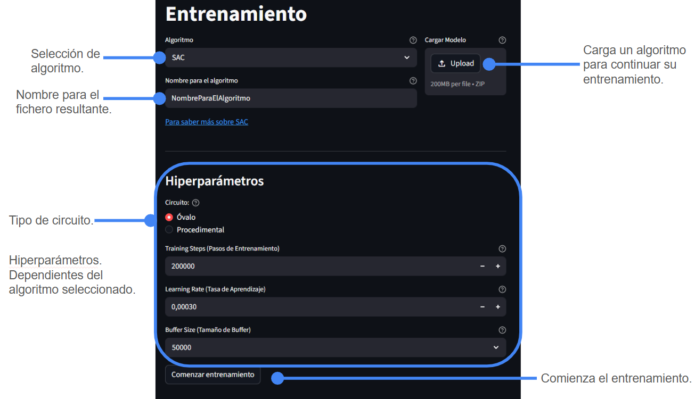

# Anexo: Uso de Interfaz

En este anexo se detalla el uso de la interfaz visual proporcionada en el proyecto.

## Barra Lateral: Elección de Sección

En la barra lateral izquierda se puede elegir la sección:

- **Entrenamiento**: Despliega la sección de entrenamiento. Esta muestra una configuración común, como el algoritmo, un botón de subida de un modelo ya existente y un nombre para el algoritmo resultante, y los hiperparámetros asociados a dicho algoritmo.
- **Visualización**: Permite lanzar una visualización con PyGame con un modelo pre-entrenado sobre un circuito.

### Entrenamiento

**Algoritmos disponibles**:

- SAC
- A2C

**Nombre:**

Será el nombre del fichero resultante al finalizar el entrenamiento. La terminal indicará exactamente dónde se está guardando dicho archivo, así como su mejor versión hasta el momento. Se recomienda consultarla en caso de duda.

**IMPORTANTE:** Si se mantiene el mismo nombre que un algoritmo ya existente este será sobreescrito sin previo aviso. Se recomienda especial atención a la hora de escribir un nombre o de cargar un algoritmo, ya que escribirá automáticamente el nombre del fichero.

**Hiperparámetros:**

Circuito:

- Óvalo: Circuito simple y estático. Siempre el mismo. Ideal para las primeras iteraciones.
- Procedimental: Circuito más complejo y generado mediante un algoritmo. No existen dos circuitos idénticos. (En caso de fallo en la creación del circuito se crea un óvalo. Este fenómeno ocurre un porcentaje de veces muy bajo).

Cada algoritmo tiene sus propios hiperparámetros asociados. Se recomienda utilizar los *tooltips* representandos como un signo de interrogación (?) para informarse.

Los hiperparámetros configurados por defecto son los ideales como base para los algoritmos. Son un buen punto de partida.

**Comenzar entrenamiento**:

El botón de “Comenzar entrenamiento” pone en marcha el entrenamiento. Esto supone partir de 0 en el caso de no proporcionar un algoritmo en el botón de “Carga de Modelo” o continuar un entrenamiento en caso de hacerlo.

Se recomienda no utilizar la aplicación mientras se se realiza un entrenamiento. Esto puede generar fallos que invaliden el entrenamiento o cuelgen la aplicación.

Para parar un entrenamiento esto debe realizarse desde la terminal con la combinación **Ctrl + C**. No ha sido posible introducir un botón para parar el entrenamiento en esta primera versión del prototipo.

## Visualización

**Circuito:**

Circuitos disponibles para realizar la visualización. Funcionan igual que en el apartado de Entrenamiento.

**Cargar Modelo:**

Se debe cargar un modelo con la extensión `.zip`. Al hacerlo se habilitará un botón para lanzar la visualización en una pantalla de PyGame.